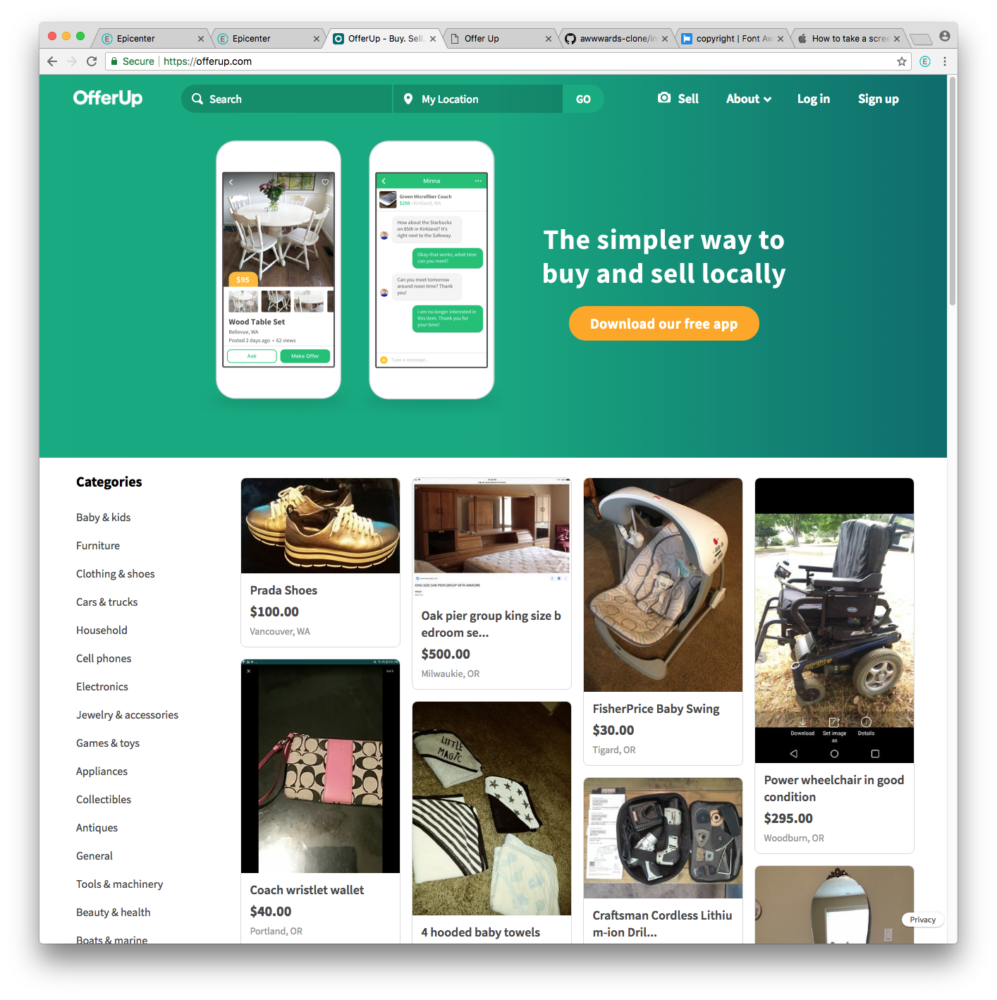
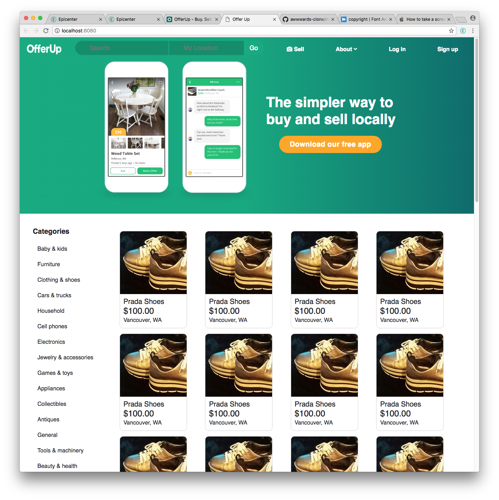

# Website Clone of OfferUp

## By Sean McDermott

# Description
This is the CSS/Design Week One code review. Our goal was to clone a website.

This is the original website.

This is a website clone of OfferUp.

# Specifications
* This is a clone of the Website OfferUp. It is purely for design purposes and contains no functionality other than media queries to change the appearance of the screen as it gets smaller.

# Setup Requirements
* Clone this repository
* Run npm install to install all dependencies
* Run npm run start to build and start the development environment

# Notes
* To hold all images, **Make a folder called 'images' in the src/ directory**
* If you want to rename your assets folder, currently known as 'images', **Make sure to change the outputPath and inputPath in webpack.config.js > module > rules > file-loader to your desired assets directory name.**

# Technologies
* HTML
* CSS
* JavaScript
* Webpack
* Jasmine
* Karma

This project uses the _MIT License_
&copy; **Sean McDermott** 2018
